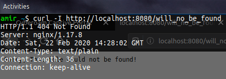
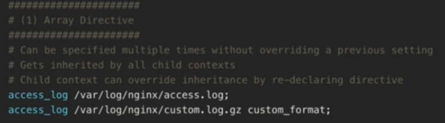
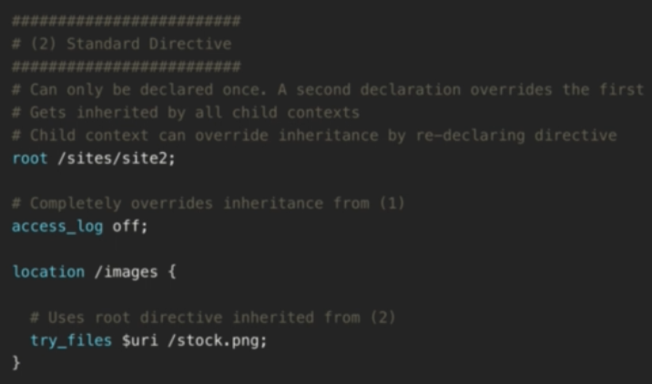
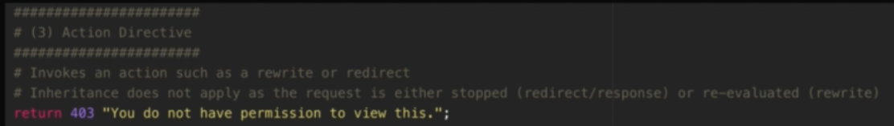
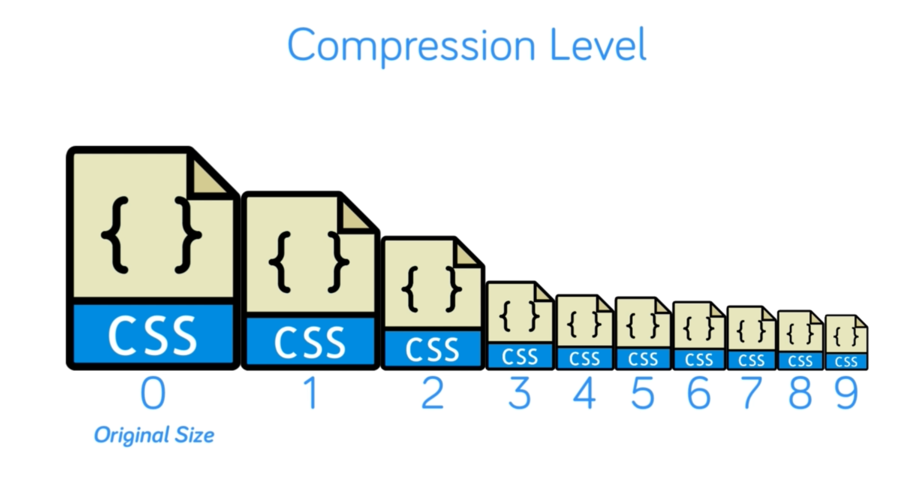
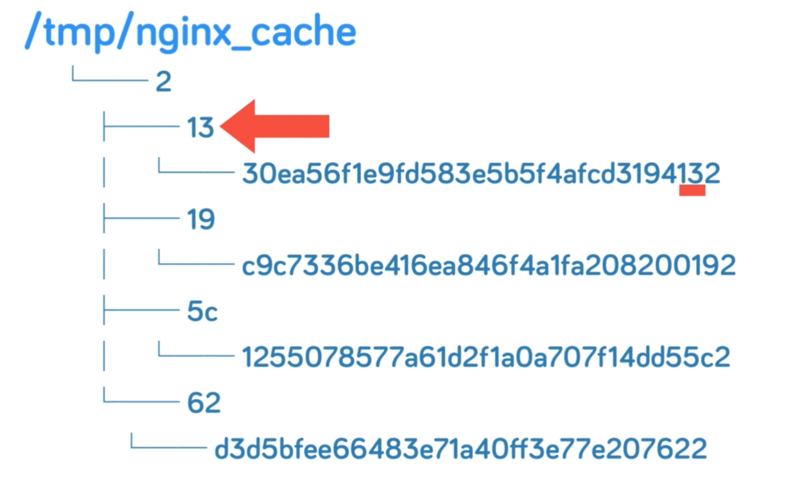

# Location Blocks And Matching URIs

```nginx
server {
    location URI {
        # handel response for this sepesific uri
    }
}
        # Example
        location /greet {
             return 200 'Helo from Nginx "/greet" location.';
        }
```

```nginx
        # this is care sensetive
        location ~ /greet[0-9] {
            return 200 'Helo from Nginx "/greet" location. REGEX MATCH.';
        }
```

To turn it into a case unsensetive just add an *

```nginx
        # this is care sensetive
        location ~* /greet[0-9] {
            return 200 'Helo from Nginx "/greet" location. REGEX MATCH.';
        }

```

Order of math in nginx location

* = - (Exact math)
* ~ - REGEX match case sensitive
* ~* - REGEX match case insensitive
* ^~ - Prefenrentional Prefix match
* Empty - (Prefix math)


## Nginx Variables

```nginx
location /inspect {
    return 200 "$host\nName: $arg_name";
}
```


## Using conditional

Without the apikey param like `example.com?apikye=1234` we get 401

```nginx
http {
    server {
        listen 80;
        server_name 10.0.2.15;
        root /sites/demo;

        if ( $arg_apikey != 1234 ) {
            return 401  "Incorrect API Key"
        }
    }
}
```

To check if it's  weekand and if yes return Yes

```nginx
    server {
        # this port will accept requtst
        listen 80;
        # this could be domainname.com *.domainname.com which will be translate to www.domainname.com and all other subdomains
        server_name 10.0.2.15;
        # where to look for files
        # default is the root path of nginx
        root /sites/demo;

        set $weekend 'No';
        # check if weekend
        if ($date_local ~ 'Saturday|Sunday') {
            set $weekend 'Yes';
        }
        location /is_weekend {
            return 200 "$weekend\n";
        }
```


## Rewrite - Redirect


In the case of redirect the return number change to 307 and the second parameter change to a uri
Change the location of /logo to /thumb.jpg

```nginx
        location /logo {
            return 307 /thumb.jpg;
        }
```

With rewirte - **this way request rewirte internally only and client wouldn't know about it**  
With () on `\w+` we can capture the name in there and pass it to the other part

```nginx
        rewrite ^/user/\w+ /greet;
        # this will reevaluate again

        location /greet {
            return 200 "Hello User\n";
        }
```


## Flag in rewrite url

In this part john will see the thumb.jpg

```nginx
        rewrite ^/user/(\w+) /greet/$1;
        rewrite ^/greet/john /thumb.jpg;
        # this will reevaluate again

        location /greet {
            return 200 "Hello User\n";
        }

        location = /greet/john {
            return 200 "Hellooooo MY BITCH, john\n";
        }
```

But with having **last** in first rewirte the redirection will not happens anymore,
and john will see his special greeing message.

```nginx
        rewrite ^/user/(\w+) /greet/$1 last;
        rewrite ^/greet/john /thumb.jpg;
        # this will reevaluate again

        location /greet {
            return 200 "Hello User\n";
        }

        location = /greet/john {
            return 200 "Hellooooo MY BITCH, john\n";
        }
```

## Try Files

In `server` or `location` context.
This server try try_files independent of the incoming uri in request.
All uri will go to try_files.  
try_files will check in order so if the first arg exist, try_files serve it. the same applies for
the second and third one.
the final arg in try_files will result in a rewrite in the directive. all the other args will check
reletive to the root directory.
**The last element will cuase rewrite**

```nginx
    server {
        listen 80;
        server_name 10.0.2.15;
        root /sites/demo;

        try_files $uri /cat.jpg /greet /friendly_404;

        location /friendly_404 {
            return 404 "Sorry, That file could not be found!";
        }
        location /greet {
            return 200 "Hello User\n";
        }
    }
```

In try_files

1. first look if the uri exists, ex: style.css.
2. server an image if image could be found on the server.
3. server the greet it that one match the uri. (This location exist but reletive to the root directory it DOES NOT exists)
4. show a 404 page -> this one gets reevaluated.


By using a name we can be sure that no evaluation has to happen to the final arg

```nginx
    server {
        listen 80;
        server_name 10.0.2.15;
        root /sites/demo;

        try_files $uri /cat.jpg /greet @friendly_404;

        location @friendly_404 {
            return 404 "Sorry, That file could not be found!";
        }
        location /greet {
            return 200 "Hello User\n";
        }
    }
```

## Loggins

Erros and Access

```nginx
        location /sercure {
            aceess_log /var/log/nginx/secure.access.log
            return 200 "Secure path"
        }
```

To disable loggin `access_log off;`

## Types Of Directive

* Array Directive  

* Standard Directive  

* Action Directive  


## PHP Process

```nginx
events {}
http {
        server {
        listen 80;
        server_name 10.0.2.15;
        root /sites/demo;

        index index.php index.html;

        location / {
            try_files $uri $uri/ =404;
        }

        location ~\.php$ {
            # pass the request to php-fpm service
            include fastcgi.conf;
            fastcgi_pass unix:/run/php/php7.2-fpm.sock;
        }
    }
```

When requesting for a php page we'll get a 505 error.

`$ curl localhost:8080/info.php`

```html
<html>
<head><title>502 Bad Gateway</title></head>
<body>
<center><h1>502 Bad Gateway</h1></center>
<hr><center>nginx/1.17.8</center>
</body>
</html>
```

This is because of a permission denied as the below error log suggest.

```bash
$ tail -n 1 /var/log/nginx/error.log
2020/02/23 06:45:51 [crit] 9191#0: *6 connect() to unix:/run/php/php7.2-fpm.sock failed (13: Permission denied) while connecting to upstream, client: 10.0.2.2, server: 10.0.2.15, request: "GET /info.php HTTP/1.1", upstream: "fastcgi://unix:/run/php/php7.2-fpm.sock:", host: "localhost:8080"
```

```bash
$ ps -aux | grep nginx
root       990  0.0  0.3  33072  3228 ?        Ss   05:55   0:00 nginx: master process /usr/bin/nginx
nobody    9191  0.0  0.3  37584  3844 ?        S    06:43   0:00 nginx: worker process
root      9256  0.0  0.1  13136  1148 pts/1    S+   06:50   0:00 grep --color=auto nginx
```

```bash
$ ps -aux | grep php-fpm
root      8344  0.0  1.6 289152 17056 ?        Ss   06:20   0:00 php-fpm: master process (/etc/php/7.2/fpm/php-fpm.conf)
www-data  8360  0.0  0.7 291448  7304 ?        S    06:20   0:00 php-fpm: pool www
www-data  8361  0.0  0.7 291448  7304 ?        S    06:20   0:00 php-fpm: pool www
root      9264  0.0  0.0  13136   976 pts/1    S+   06:51   0:00 grep --color=auto php-fpm
```

As it seems nginx worker proces user is *nobody* while php-fpm process blogs to *www-data* user.
Changing the ningx worker process user is a resonable action. `user <username>` need to be added
to the conf file.

```nginx
user www-data;

events {}
http {
        server {
        listen 80;
        server_name 10.0.2.15;
        root /sites/demo;

        index index.php index.html;

        location / {
            try_files $uri $uri/ =404;
        }

        location ~\.php$ {
            # pass the request to php-fpm service
            include fastcgi.conf;
            fastcgi_pass unix:/run/php/php7.2-fpm.sock;
        }
    }
```

## Worker Process

Default Nginx has a master and a worker process

```bash
$ systemctl status nginx
● nginx.service - The NGINX HTTP and reverse proxy server
   Loaded: loaded (/lib/systemd/system/nginx.service; enabled; vendor preset: enabled)
   Active: active (running) (Result: exit-code) since Sun 2020-02-23 05:55:39 UTC; 1h 13min ago
  Process: 9315 ExecReload=/usr/bin/nginx -s reload (code=exited, status=0/SUCCESS)
 Main PID: 990 (nginx)
    Tasks: 2 (limit: 1108)
   CGroup: /system.slice/nginx.service
           ├─ 990 nginx: master process /usr/bin/nginx
           └─9316 nginx: worker process
```

Optimized number of worker is to increase the number of processes to the number of cpu core.
Or doing this with `worker_porcesses auto;` can make this action automatically.
On a 10 core cpu we get

```bash
$ systemctl status nginx
● nginx.service - The NGINX HTTP and reverse proxy server
   Loaded: loaded (/lib/systemd/system/nginx.service; enabled; vendor preset: enabled)
   Active: active (running) (Result: exit-code) since Sun 2020-02-23 05:55:39 UTC; 1h 16min ago
  Process: 9768 ExecReload=/usr/bin/nginx -s reload (code=exited, status=0/SUCCESS)
 Main PID: 990 (nginx)
    Tasks: 11 (limit: 1108)
   CGroup: /system.slice/nginx.service
           ├─ 990 nginx: master process /usr/bin/nginx
           ├─9769 nginx: worker process
           ├─9770 nginx: worker process
           ├─9771 nginx: worker process
           ├─9772 nginx: worker process
           ├─9773 nginx: worker process
           ├─9774 nginx: worker process
           ├─9775 nginx: worker process
           ├─9776 nginx: worker process
           ├─9777 nginx: worker process
           └─9778 nginx: worker process
```

Each worker can accept a certain number of requests.
This limit can be specified by the number of files the server can open at once.

```bash
$ ulimit -n
1024
```

```nginx
worker_processes auto;

events {
    # size of the opend files limit
    worker_connections 1024;
}
```

max Number of proccesses this server can accept is multiplication of this two numbers.

## Buffering and Timeout

Buffer Directive

* 100 - bytes
* 10K/10k - kilobytes
* 10M/10m - megabytes

Timeout Directive

* 30 - miliseconds
* 30s - seconds
* 30m - minutes
* 30h - hours
* 30d - days

Some configuration for buffer and timeout

```nginx
http {
    # 2. use mime type inside nginx folder
    include mime.types;

    # Buffer size for post submission
    client_body_buffer_size 10K;
    client_max_body_size 8M;

    # Header buffer size
    client_header_buffer_size 1K;

    # Max time to revice client headers/body default is 60 seconds
    # Time between consecutive read operations in buffer
    client_body_timeout 12;
    client_header_timeout 12;

    # Max time to keep a connection open
    # reduce connection overhead
    # but our pool max connection can read it's maximum connection do not close

    keepalive_timeout 15;

    # Max time for the client to accept/reecive  a response
    send_timeout 10;

    # Skip buffer for static files
    sendfile on;

    # Optimze sendfile packets
    tcp_nopush on;

```

## Add Module to The Nginx

`$ nginx -V` will show the nginx build configuration. In our case is :  

```bash
configure arguments: --sbin-path=/usr/bin/nginx --conf-path=/etc/nginx/nginx.conf --error-log-path=/var/log/nginx/error.log --http-log-path=/var/log/nginx/access.log --with-pcre --pid-path=/var/run/nginx.pid --with-http_ssl_module
```

```bash
$ nginx -V
nginx version: nginx/1.17.8
built by gcc 7.4.0 (Ubuntu 7.4.0-1ubuntu1~18.04.1)
built with OpenSSL 1.1.1  11 Sep 2018
TLS SNI support enabled
configure arguments: --sbin-path=/usr/bin/nginx --conf-path=/etc/nginx/nginx.conf --error-log-path=/var/log/nginx/error.log --http-log-path=/var/log/nginx/access.log --with-pcre --pid-path=/var/run/nginx.pid --with-http_ssl_module --with-http_image_filter_module=dynamic --modules-path=/etc/nginx/modules
...
Configuration summary
  + using system PCRE library
  + using system OpenSSL library
  + using system zlib library

  nginx path prefix: "/usr/local/nginx"
  nginx binary file: "/usr/bin/nginx"
  nginx modules path: "/etc/nginx/modules"
  nginx configuration prefix: "/etc/nginx"
  nginx configuration file: "/etc/nginx/nginx.conf"
  nginx pid file: "/var/run/nginx.pid"
  nginx error log file: "/var/log/nginx/error.log"
  nginx http access log file: "/var/log/nginx/access.log"
  nginx http client request body temporary files: "client_body_temp"
  nginx http proxy temporary files: "proxy_temp"
  nginx http fastcgi temporary files: "fastcgi_temp"
  nginx http uwsgi temporary files: "uwsgi_temp"
  nginx http scgi temporary files: "scgi_temp"
```

We can se that the moudle folder is being created. To use this module we need to load it.

```nginx
load_module /etc/nginx/modules/ngx_http_image_filter_module.so;

http{
    server{
        location = /thumb.jpg {
            image_filter rotate 90;
        }
    }
}
```

## Headers And Expires

Adding header enable the web server to optimize its static content like the example:

```nginx
        location ~* \.(css|js|jpg|png)$ {
            access_log off;
            # add_header  my_header "Hello world";
            add_header Cache-Control public; # tell the client it can cache this content
            add_header Pragma public; # lagacy
            add_header Vary Accept-Encoding;
            expires 1M; # for one month
        }
```

With a curl request we can the added header.
*Cache-Control: max-age=* tell the expire date in seconds.

```bash
curl -I localhost:8080/thumb.jpg
HTTP/1.1 200 OK
Server: nginx/1.17.8
Date: Mon, 24 Feb 2020 04:13:10 GMT
Content-Type: image/jpeg
Content-Length: 27244
Last-Modified: Sat, 22 Feb 2020 13:14:23 GMT
Connection: keep-alive
ETag: "5e51292f-6a6c"
Expires: Wed, 25 Mar 2020 04:13:10 GMT
Cache-Control: max-age=2592000
Cache-Control: public
Pragma: public
Vary: Accept-Encoding
Accept-Ranges: bytes
```

## Compress response  (gzip)

With `Vary Accept-Encoding` nginx will be enabled to compress that path.
Now we need to add this conf. now all the child context will be able to compress
their reponses.

```nginx
http {
    # 2. use mime type inside nginx folder
    include mime.types;

    gzip on;
    gzip_comp_level 3;
    gzip_types text/css;
    gzip_types text/javascript;
```



With a normal request there will be no compression, we have to add the compresing in the header.

```bash
$ curl -I localhost:8080/bootstrap.css
HTTP/1.1 200 OK
Server: nginx/1.17.8
Date: Mon, 24 Feb 2020 04:23:58 GMT
Content-Type: text/css
Content-Length: 159515
Last-Modified: Sat, 22 Feb 2020 13:14:23 GMT
Connection: keep-alive
ETag: "5e51292f-26f1b"
Expires: Wed, 25 Mar 2020 04:23:58 GMT
Cache-Control: max-age=2592000
Cache-Control: public
Pragma: public
Vary: Accept-Encoding
Accept-Ranges: bytes
```

With compressing header.

```bash
$ curl -I -H "Accept-Encoding: gzip, deflate" localhost:8080/bootstrap.css
HTTP/1.1 200 OK
Server: nginx/1.17.8
Date: Mon, 24 Feb 2020 04:25:14 GMT
Content-Type: text/css
Last-Modified: Sat, 22 Feb 2020 13:14:23 GMT
Connection: keep-alive
ETag: W/"5e51292f-26f1b"
Expires: Wed, 25 Mar 2020 04:25:14 GMT
Cache-Control: max-age=2592000
Cache-Control: public
Pragma: public
Vary: Accept-Encoding
Content-Encoding: gzip
```

## FastCGI cache ( server side caching )



Our structures in nginx_cache
```bash
~nginx_cache# &tree
.
└── 5
    └── 41
        └── dcb5f7cd31a3ea1bb01b0a0e1a658415
```

Simple Caching conf for fastcgi

```nginx
user www-data;

worker_processes auto;

events {
    # size of the opend files limit
    worker_connections 1024;
}

http {
    include mime.types;

    # levels is the cache depth for directories
    # key_zone use to refere to this cache later in this confing and the size of the cache
    # it this confing its 100m
    # inactive determine when this cache should be deleted
    fastcgi_cache_path /tmp/nginx_cache levels=1:2 keys_zone=ZONE_1:100m inactive=60m;

    # key sheema will be something like this -> http:// Get domain.com /blog/article (md5 hash)
    fastcgi_cache_key "$scheme$request_method$host$request_uri";

    # know the client it was server from the cache
    add_header X-Cache $upstream_cache_status;  


    server {
        # this port will accept requtst 
        listen 80;
        # this could be domainname.com *.domainname.com which will be translate to www.domainname.com and all other subdomains
        server_name 10.0.2.15;
        # where to look for files
        # default is the root path of nginx
        root /sites/demo;

        index index.php index.html;

        # Catch by default - this enable cache exception
        set $no_cache 0;
        
        # if request has ?skpicache=1 then skip caching
        if ($arg_skipcache = 1) {
            set $no_cache 1;
        }
        
        location / {
            try_files $uri $uri/ =404;
        }
        
        location ~\.php$ {
            # pass the request to php-fpm service 
            include fastcgi.conf;
            fastcgi_pass unix:/run/php/php7.2-fpm.sock;

            # Enable cache
            fastcgi_cache ZONE_1;
            # enable caching for 200 requests
            fastcgi_cache_valid 200 60m;
            # fastcgi_cache_valid 404 10m;

            # bypass serving from cache if no cache is 1
            fastcgi_cache_bypass $no_cache; 
            # skip writing in the cache 
            fastcgi_no_cache $no_cache; 

        }
    }
}
```

Server Performance without cache enable and a request which takes about 1 second to responde.

```bash
$ ab -n 100 -c 10 http://127.0.0.1/
This is ApacheBench, Version 2.3 <$Revision: 1807734 $>
Copyright 1996 Adam Twiss, Zeus Technology Ltd, http://www.zeustech.net/
Licensed to The Apache Software Foundation, http://www.apache.org/

Benchmarking 127.0.0.1 (be patient).....done


Server Software:        nginx/1.17.8
Server Hostname:        127.0.0.1
Server Port:            80

Document Path:          /
Document Length:        37 bytes

Concurrency Level:      10
Time taken for tests:   21.631 seconds
Complete requests:      100
Failed requests:        0
Total transferred:      17400 bytes
HTML transferred:       3700 bytes
Requests per second:    4.62 [#/sec] (mean)
Time per request:       2163.068 [ms] (mean)
Time per request:       216.307 [ms] (mean, across all concurrent requests)
Transfer rate:          0.79 [Kbytes/sec] received

Connection Times (ms)
              min  mean[+/-sd] median   max
Connect:        0    0   0.1      0       0
Processing:  1035 2056 282.4   2015    3517
Waiting:     1035 2056 282.4   2015    3517
Total:       1035 2056 282.4   2015    3517

Percentage of the requests served within a certain time (ms)
  50%   2015
  66%   2019
  75%   2024
  80%   2026
  90%   2047
  95%   2500
  98%   3057
  99%   3517
 100%   3517 (longest request)
```

Same request

```bash
$ ab -n 100 -c 10 http://127.0.0.1/
This is ApacheBench, Version 2.3 <$Revision: 1807734 $>
Copyright 1996 Adam Twiss, Zeus Technology Ltd, http://www.zeustech.net/
Licensed to The Apache Software Foundation, http://www.apache.org/

Benchmarking 127.0.0.1 (be patient).....done


Server Software:        nginx/1.17.8
Server Hostname:        127.0.0.1
Server Port:            80

Document Path:          /
Document Length:        37 bytes

Concurrency Level:      10
Time taken for tests:   3.068 seconds
Complete requests:      100
Failed requests:        0
Total transferred:      17400 bytes
HTML transferred:       3700 bytes
Requests per second:    32.59 [#/sec] (mean)
Time per request:       306.805 [ms] (mean)
Time per request:       30.681 [ms] (mean, across all concurrent requests)
Transfer rate:          5.54 [Kbytes/sec] received

Connection Times (ms)
              min  mean[+/-sd] median   max
Connect:        0    0   0.7      0       3
Processing:     0  179 573.2      1    3063
Waiting:        0  179 572.8      1    3062
Total:          0  179 573.9      1    3066

Percentage of the requests served within a certain time (ms)
  50%      1
  66%      1
  75%      1
  80%      1
  90%   1064
  95%   2071
  98%   2121
  99%   3066
 100%   3066 (longest request)
```

Hit Or Miss? i guess nginx never miss! Huh.
You got a new cache, bet it doesn't miss you.

```bash
# first time miss
$ curl -I localhost:8080
HTTP/1.1 200 OK
Server: nginx/1.17.8
Date: Mon, 24 Feb 2020 04:56:44 GMT
Content-Type: text/html; charset=UTF-8
Connection: keep-alive
X-Cache: MISS

# second time hit
$ curl -I localhost:8080
HTTP/1.1 200 OK
Server: nginx/1.17.8
Date: Mon, 24 Feb 2020 04:56:48 GMT
Content-Type: text/html; charset=UTF-8
Connection: keep-alive
X-Cache: HIT
```

Now if we have skipping cache feature in server side we can see someting like this

```bash
$ curl -I http://localhost:8080/?skipcache=1
HTTP/1.1 200 OK
Server: nginx/1.17.8
Date: Mon, 24 Feb 2020 19:26:25 GMT
Content-Type: text/html; charset=UTF-8
Connection: keep-alive
X-Cache: BYPASS
```

```bash
$ curl -I http://localhost:8080/?skipcache=0
HTTP/1.1 200 OK
Server: nginx/1.17.8
Date: Mon, 24 Feb 2020 19:26:28 GMT
Content-Type: text/html; charset=UTF-8
Connection: keep-alive
X-Cache: MISS
```

```bash
$ curl -I http://localhost:8080/?skipcache=0
HTTP/1.1 200 OK
Server: nginx/1.17.8
Date: Mon, 24 Feb 2020 19:26:29 GMT
Content-Type: text/html; charset=UTF-8
Connection: keep-alive
X-Cache: HIT
```

## HTTP 2

* It's a binary protocal ( HTTP 1 is a textual protocal )
* Compressed Header
* Use persistent Connection
* Mutliplex Streaming ( Use a simgle connection to send html, css, javascript, ect into a single stream of data )
* Server Push

In case of HTTP 1.1 for transmiting a single page consist of (html, css and javascript) there
would be 3 connection to be opned.  
Nginx need a rebuild to enable HTTP V2 ( The ssl has to be enable )

```bash
./configure --sbin-path=/usr/bin/nginx --conf-path=/etc/nginx/nginx.conf --error-log-path=/var/log/nginx/error.log --http-log-path=/var/log/nginx/access.log --with-pcre --pid-path=/var/run/nginx.pid --with-http_ssl_module --with-http_image_filter_module=dynamic --modules-path=/etc/nginx/modules --with-http_v2_module
``` 

HTTP2 need https to be enabled so we have to create a key and cert for this part with the help of openssl.

```bash
$ openssl req -x509 -days 10 -nodes -newkey rsa:2048 -keyout /etc/nginx/ssl/self.key  -out /etc/nginx/ssl/self.crt
```

### Nginx Conf

```nginx
user www-data;


worker_processes auto;

events {
    # size of the opend files limit
    worker_connections 1024;
}
 
http {
    # 2. use mime type inside nginx folder
    include mime.types;

    server {
        # enable ssl and http2
        listen 443 ssl http2;
        # this could be domainname.com *.domainname.com which will be translate to www.domainname.com and all other subdomains
        server_name 10.0.2.15;
        # where to look for files
        # default is the root path of nginx
        root /sites/demo;

        index index.php index.html;

        # tell nginx where the key and crt are located
        ssl_certificate /etc/nginx/ssl/self.crt;
        ssl_certificate_key /etc/nginx/ssl/self.key;

        location / {
            try_files $uri $uri/ =404;
        }
        
        location ~\.php$ {
            # pass the request to php-fpm service 
            include fastcgi.conf;
            fastcgi_pass unix:/run/php/php7.2-fpm.sock;
        }
    }
}
```

It works as default on http2

```bash
$ curl -Ik https://localhost:8443/index.html
HTTP/2 200 
server: nginx/1.17.8
date: Wed, 26 Feb 2020 15:55:34 GMT
content-type: text/html
content-length: 15116
last-modified: Sat, 22 Feb 2020 13:14:23 GMT
etag: "5e51292f-3b0c"
accept-ranges: bytes
```

And can work with http1.1
```bash
$ curl -Ik https://localhost:8443/index.html --http1.1
HTTP/1.1 200 OK
Server: nginx/1.17.8
Date: Wed, 26 Feb 2020 15:56:18 GMT
Content-Type: text/html
Content-Length: 15116
Last-Modified: Sat, 22 Feb 2020 13:14:23 GMT
Connection: keep-alive
ETag: "5e51292f-3b0c"
Accept-Ranges: bytes
```

## HTTP2 Server Push

Sending all file in a Mutltiplex
To inspect this feature we use *nghttp2*

on the simple server with no server push `index.html` will only be deliverd.
we want all the file to be delivered at the same time.

```bash
$ nghttp -nys https://localhost:8443/index.html
***** Statistics *****

Request timing:
  responseEnd: the  time  when  last  byte of  response  was  received
               relative to connectEnd
 requestStart: the time  just before  first byte  of request  was sent
               relative  to connectEnd.   If  '*' is  shown, this  was
               pushed by server.
      process: responseEnd - requestStart
         code: HTTP status code
         size: number  of  bytes  received as  response  body  without
               inflation.
          URI: request URI

see http://www.w3.org/TR/resource-timing/#processing-model

sorted by 'complete'

id  responseEnd requestStart  process code size request path
 13      +519us        +36us    483us  200  14K /index.html
```

If we force to download all other file we can see that they will be downloaded after the receiving
the `index.html` file
```bash
$ nghttp -nysa https://localhost:8443/index.html
***** Statistics *****

Request timing:
  responseEnd: the  time  when  last  byte of  response  was  received
               relative to connectEnd
 requestStart: the time  just before  first byte  of request  was sent
               relative  to connectEnd.   If  '*' is  shown, this  was
               pushed by server.
      process: responseEnd - requestStart
         code: HTTP status code
         size: number  of  bytes  received as  response  body  without
               inflation.
          URI: request URI

see http://www.w3.org/TR/resource-timing/#processing-model

sorted by 'complete'

id  responseEnd requestStart  process code size request path
 13     +3.12ms       +168us   2.95ms  200  14K /index.html
 17     +6.75ms      +3.15ms   3.60ms  200  435 /album.css
 15    +12.20ms      +3.15ms   9.05ms  200 155K /bootstrap.css
 21    +16.84ms      +3.16ms  13.68ms  200  69K /jquery-3.js
 23    +18.34ms      +3.16ms  15.18ms  200  78K /bootstrap.js
 19    +18.63ms      +3.16ms  15.47ms  200  26K /thumb.jpg
```

### Nginx conf for server push

In a location we have to specify the resources needed. ( with http2 enabled).

```nginx
        location = /index.html {
            http2_push /album.css;
            http2_push /bootstrap.css;
            http2_push /jquery-3.js;
            http2_push /bootstrap.js;
            http2_push /thumb.jpg;
        }
```


## Nginx SSL and TLS

Now that we have our sire over https ( port 443 ), port 80 will not respond.
A solution is to redirect all the http request to https

Nginx conf to redirect 80 to 443.

```nginx
http {
    # new server locaion for port 80 to redirect to https
    server {
        listen 80;
        server_name 10.0.2.15;
        return 301 https://$host$request_uri;
    }

    server {
        listen 443 ssl http2;
        server_name 10.0.2.15;
        root /sites/demo;

        ssl_certificate /etc/nginx/ssl/self.crt;
        ssl_certificate_key /etc/nginx/ssl/self.key;
    }
}
```

Now we are going to take a step further and enable tls and all oher cool stuff to boost our secutiry.


```nginx
    server {
        # this port will accept requtst 
        listen 443 ssl http2;
        # this could be domainname.com *.domainname.com which will be translate to www.domainname.com and all other subdomains
        server_name 10.0.2.15;
        # where to look for files
        # default is the root path of nginx
        root /sites/demo;

        index index.html;

        ssl_certificate /etc/nginx/ssl/self.crt;
        ssl_certificate_key /etc/nginx/ssl/self.key;

        # Disable ssl
        ssl_protocols TLSv1 TLSv1.1 TLSv1.2;
        
        # Optimise cipher suits
        ssl_prefer_server_ciphers on;
        ssl_ciphers ECDH+AESGCM:ECDH+AES256:ECDH+AES128:DH+3DES:!ADH:!AECDH:!MD5;

        # Enable DH paramateds
        ssl_dhparam /etc/nginx/ssl/dhparam.pem;

        # Enable HSTS
        # don't load anytning over http
        add_header Strict-Transport-Security "max-age=31536000" always;

        # SSL seassions
        # with shared the cache is in memory and can be access by any worker
        ssl_session_cache shared:SSL:40m;
        ssl_session_timeout 4h;
        # if client has ticket don't loopup for key in cache
        ssl_session_tickets on;

    }
}
```

And generate the DH params with *openssl*.
`openssl dhparam -out dhparam.pem 2048`

## Rage Limit

Install *siege* which look like *apache bench* but has more foucs on stres test.

```bash
$ siege -v -r 2 -c 5 https://localhost:8443/thumb.jpg
** SIEGE 4.0.4
** Preparing 5 concurrent users for battle.
The server is now under siege...
HTTP/1.1 200     0.00 secs:   27244 bytes ==> GET  /thumb.jpg
HTTP/1.1 200     0.00 secs:   27244 bytes ==> GET  /thumb.jpg
HTTP/1.1 200     0.00 secs:   27244 bytes ==> GET  /thumb.jpg
HTTP/1.1 200     0.00 secs:   27244 bytes ==> GET  /thumb.jpg
HTTP/1.1 200     0.00 secs:   27244 bytes ==> GET  /thumb.jpg
HTTP/1.1 200     0.01 secs:   27244 bytes ==> GET  /thumb.jpg
HTTP/1.1 200     0.01 secs:   27244 bytes ==> GET  /thumb.jpg
HTTP/1.1 200     0.01 secs:   27244 bytes ==> GET  /thumb.jpg
HTTP/1.1 200     0.01 secs:   27244 bytes ==> GET  /thumb.jpg
HTTP/1.1 200     0.01 secs:   27244 bytes ==> GET  /thumb.jpg

Transactions:		          10 hits
Availability:		      100.00 %
Elapsed time:		        0.01 secs
Data transferred:	        0.26 MB
Response time:		        0.00 secs
Transaction rate:	     1000.00 trans/sec
Throughput:		       25.98 MB/sec
Concurrency:		        5.00
Successful transactions:          10
Failed transactions:	           0
Longest transaction:	        0.01
Shortest transaction:	        0.00
```

All of the r2*c10 of the request has been answered.


```nginx
http{
    # Define limit zone 
    # base on server block $server_name
    # user ip $binary_remove_addr
    # specific uri $request_uri
    # 60r/m 60 requets for a minutes ( in other word 1 req per second )
    limit_req_zone $request_uri zone=MYZONE:10m rate=60r/m;

    server {

        location / {
            # burst slow down the traffic
            limit_req zone=MYZONE;
        }
    }
}
```


In this zone only the first one get answers and the other rejected.
This is becuase the client is limited to 1r/s.

```bash
$ siege -v -r 2 -c 5 https://localhost:8443/thumb.jpg
** SIEGE 4.0.4
** Preparing 5 concurrent users for battle.
The server is now under siege...
HTTP/1.1 200     0.01 secs:   27244 bytes ==> GET  /thumb.jpg
HTTP/1.1 503     0.01 secs:     197 bytes ==> GET  /thumb.jpg
HTTP/1.1 503     0.01 secs:     197 bytes ==> GET  /thumb.jpg
HTTP/1.1 503     0.01 secs:     197 bytes ==> GET  /thumb.jpg
HTTP/1.1 503     0.01 secs:     197 bytes ==> GET  /thumb.jpg
HTTP/1.1 503     0.00 secs:     197 bytes ==> GET  /thumb.jpg
HTTP/1.1 503     0.00 secs:     197 bytes ==> GET  /thumb.jpg
HTTP/1.1 503     0.00 secs:     197 bytes ==> GET  /thumb.jpg
HTTP/1.1 503     0.00 secs:     197 bytes ==> GET  /thumb.jpg
HTTP/1.1 503     0.00 secs:     197 bytes ==> GET  /thumb.jpg

Transactions:		           1 hits
Availability:		       10.00 %
Elapsed time:		        0.01 secs
Data transferred:	        0.03 MB
Response time:		        0.05 secs
Transaction rate:	      100.00 trans/sec
Throughput:		        2.77 MB/sec
Concurrency:		        5.00
Successful transactions:           1
Failed transactions:	           9
Longest transaction:	        0.01
Shortest transaction:	        0.00
```

With *burst* we allow **1r/s + 5 burst** within a second.
```nginx
http{
    # Define limit zone 
    # base on server block $server_name
    # user ip $binary_remove_addr
    # specific uri $request_uri
    # 60r/m 60 requets for a minutes ( in other word 1 req per second )
    limit_req_zone $request_uri zone=MYZONE:10m rate=60r/m;

    server {

        location / {
            # burst slow down the traffic
            limit_req zone=MYZONE burst=5 nodelay;
        }
    }
}
```

This time all the rquest has beed answered, but slowly.

```bash
$ siege -v -r 2 -c 5 https://localhost:8443/thumb.jpg
** SIEGE 4.0.4
** Preparing 5 concurrent users for battle.
The server is now under siege...
HTTP/1.1 200     0.03 secs:   27244 bytes ==> GET  /thumb.jpg
HTTP/1.1 200     1.03 secs:   27244 bytes ==> GET  /thumb.jpg
HTTP/1.1 200     2.03 secs:   27244 bytes ==> GET  /thumb.jpg
HTTP/1.1 200     3.03 secs:   27244 bytes ==> GET  /thumb.jpg
HTTP/1.1 200     4.03 secs:   27244 bytes ==> GET  /thumb.jpg
HTTP/1.1 200     5.00 secs:   27244 bytes ==> GET  /thumb.jpg
HTTP/1.1 200     5.00 secs:   27244 bytes ==> GET  /thumb.jpg
HTTP/1.1 200     5.00 secs:   27244 bytes ==> GET  /thumb.jpg
HTTP/1.1 200     5.00 secs:   27244 bytes ==> GET  /thumb.jpg
HTTP/1.1 200     4.99 secs:   27244 bytes ==> GET  /thumb.jpg

Transactions:		          10 hits
Availability:		      100.00 %
Elapsed time:		        9.02 secs
Data transferred:	        0.26 MB
Response time:		        3.51 secs
Transaction rate:	        1.11 trans/sec
Throughput:		        0.03 MB/sec
Concurrency:		        3.90
Successful transactions:          10
Failed transactions:	           0
Longest transaction:	        5.00
Shortest transaction:	        0.03
```

With *nodealy* enabled. doint to set of request. the first 6 get answred.
and most of the second batch get rejected.

```bash
$ siege -v -r 1 -c 6 https://localhost:8443/thumb.jpg
** SIEGE 4.0.4
** Preparing 6 concurrent users for battle.
The server is now under siege...
HTTP/1.1 200     0.00 secs:   27244 bytes ==> GET  /thumb.jpg
HTTP/1.1 200     0.00 secs:   27244 bytes ==> GET  /thumb.jpg
HTTP/1.1 200     0.00 secs:   27244 bytes ==> GET  /thumb.jpg
HTTP/1.1 200     0.00 secs:   27244 bytes ==> GET  /thumb.jpg
HTTP/1.1 200     0.00 secs:   27244 bytes ==> GET  /thumb.jpg
HTTP/1.1 200     0.01 secs:   27244 bytes ==> GET  /thumb.jpg

Transactions:		           6 hits
Availability:		      100.00 %
Elapsed time:		        0.01 secs
Data transferred:	        0.16 MB
Response time:		        0.00 secs
Transaction rate:	      600.00 trans/sec
Throughput:		       15.59 MB/sec
Concurrency:		        1.00
Successful transactions:           6
Failed transactions:	           0
Longest transaction:	        0.01
Shortest transaction:	        0.00
 
$ siege -v -r 1 -c 6 https://localhost:8443/thumb.jpg
** SIEGE 4.0.4
** Preparing 6 concurrent users for battle.
The server is now under siege...
HTTP/1.1 200     0.01 secs:   27244 bytes ==> GET  /thumb.jpg
HTTP/1.1 503     0.01 secs:     197 bytes ==> GET  /thumb.jpg
HTTP/1.1 503     0.01 secs:     197 bytes ==> GET  /thumb.jpg
HTTP/1.1 503     0.01 secs:     197 bytes ==> GET  /thumb.jpg
HTTP/1.1 503     0.01 secs:     197 bytes ==> GET  /thumb.jpg
HTTP/1.1 503     0.01 secs:     197 bytes ==> GET  /thumb.jpg

Transactions:		           1 hits
Availability:		       16.67 %
Elapsed time:		        0.01 secs
Data transferred:	        0.03 MB
Response time:		        0.06 secs
Transaction rate:	      100.00 trans/sec
Throughput:		        2.69 MB/sec
Concurrency:		        6.00
Successful transactions:           1
Failed transactions:	           5
Longest transaction:	        0.01
Shortest transaction:	        0.01
```

## Basic Auth

With apache tool `apache2-utils`, there is `htpasswd` we can use to
generate password file with

```bash
$ htpasswd -c /etc/nginx/.htpasswd user1
New password: 
Re-type new password: 
Adding password for user user1

$ cat .htpasswd 
user1:$apr1$UCod2t1G$RhnYuNpG/H70Cr/dgYn/D0
```

In location contect of nginx we can add.

```nginx
        location / {
            auth_basic "Secure Area";
            auth_basic_user_file /etc/nginx/.htpasswd;
            try_files $uri $uri/ =404;
        }
```

As soon as we load the page


# H 


'''nginx

http {
    # 2. use mime type inside nginx folder
    include mime.types;

    server_tokens off;


    # new server locaion for port 80 to redirect to https
    server {
        listen 80;
        server_name 10.0.2.15;
        return 301 https://$host$request_uri;
    }

    server {
        # this port will accept requtst 
        listen 443 ssl http2;
        # this could be domainname.com *.domainname.com which will be translate to www.domainname.com and all other subdomains
        server_name 10.0.2.15;
        # where to look for files
        # default is the root path of nginx
        root /sites/demo;

        index index.html;

        add_header X-Frame-Options "SAMEORIGIN";
        add_header X-XSS-protection "1; mode=block";

'''

After adding the iframe header.
```js
Load denied by X-Frame-Options: “SAMEORIGIN” from “https://localhost:8443/”, site does not permit cross-origin framing from “file:///home/amir/index.html”.
```